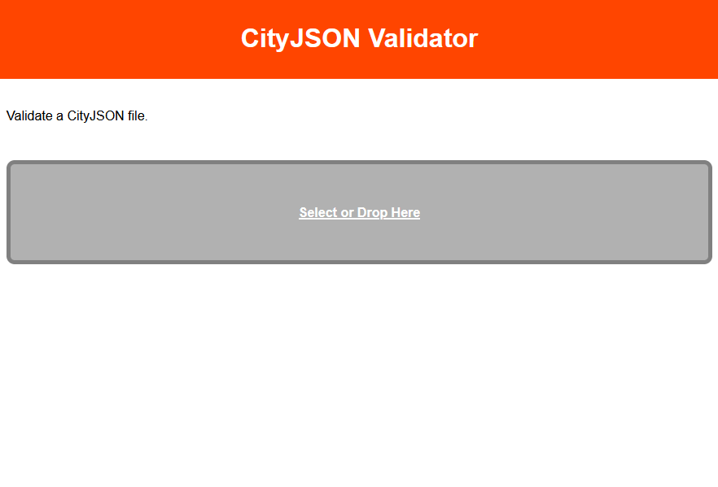

Cityjson validator on the web using Rust & Wasm
===============================================

| | |
|---|---|
|Student | Jos Feenstra 
|Code | 4465768
|Email | me@josfeenstra.nl  
|Supervisor | Hugo Ledoux


Subject
-------

The subject of this research-orientation project is building a webpage in which you can load a cityjson file. This json is then subject to a number of validity tests, after which we respond the result of these tests to the user. 

The tool was meant to be a webpage as opposed to a local piece of software, to improve the accessibility of the tool. However, during development, It became clear that it would be quite beneficial to make it **both** a local cli tool to be used on windows / mac / linux, and a web application. The local tool will ensure that we can also process a number of local files quickly and easily.

To ensure performance, and to gain access to very powerfull libraries, a language other than `Javascript` was needed. The language `Rust` was used, and compiled for web usage using WebAssembly. This is a very new language, and a new way of delivering web applications in general. Using Rust & WebAssembly, often shortened as Wasm, the process could be much faster and more reliable than only using Javascript. 


Learning Objectives
-------------------

- [X] Learn Rust
  - [X] the basics needed to created traits (classes) with a simple lay-out

- [X] Using Rust for a Geomatics application
  - [X] How to read through a json file using Rust
  - [X] How to use a low-level json validator using Rust

- [X] Deploying WebAssembly
  - [X] Which browsers to support it?
    -> [can be found here](https://webassembly.org/roadmap/)
  - [X] How to send complex data back and forth between Javascript & Rust?
    -> answer: wasm-bindgen 'shims'.
  - [X] How much of this 'glue code' is needed?
    -> I kept it as small as I could get away with. You can see inside of the `/docs/bin` folder, that we don't actually need that much glue code. 
  - [X] What needs to be done to deploy with as little 'glue code' as possible?
    -> avoiding webpack means that we have to start treating the rust code as an entirely separate thing. This is an advantage in the sense of decoupling, but a disadvantage for rapid debugging for example. 

<br/><br/>

Process
=======


## 1. Website

When starting something new, it is often nice to start from what you do know, and then proceed to tackle the unknown. This is why I started out by just creating a website in which you could drag & drop or select a json file. I have done similar things before, so after a bit of wrestling with the way javascript deals with events, callbacks, and the way css works, the website itself was there: 





A bit bland maybe, but hey it works! At least, you could select a json file, and it would print it out in the console as a `Javascript Object` . 

<br/><br/>

## 2. The Code Architecture 

Now the fun part begins. While I have tried some rust-wasm projects before, I did so by strictly following tutorials. For this project, I wished to have a better understanding of what I was actually doing. This way, I can judge if certain tools & processes are worth it, or could be left out. 

It took some time to get the hang of rust, wasm, and the different tools aiding the interoperability between the rust & javascript worlds. There where many ways of setting this up. 

I found three main ways of doing this: 
- The [Recommended]() way of setting up a rust-wasm project, 
- The [Monorepo]() style of setting up, and
- The [No Webpack](https://www.furidamu.org/blog/2020/07/10/rust-webassembly-in-the-browser/) version. 

I created a number of demo project, based on the demo's mentioned in the [Rust + Wasm Book](https://rustwasm.github.io/docs/book/), using these different methods.

At the end of the day, it started to get very overwhelming. Some of these templates mention features like custom allocators and other features I didn't want to think about just yet. None of these templates felt right for this job.

<br/><br/>


## 3. Rust

It was at this point that I followed my instinct to go back to 'vanilla rust', and test the code 'on dry land' (dutch saying: 'op 't droge') before diving in deep Wasm waters. Hugo already send me some demo code, but I had to set up the project in a slights different manner, to ensure converting it to a wasm package would be easy. 

After some initial troubles, because of the fact that traversing deserialized jsons in rust is quite clunky the way I did it, this part was working: a simple command-line tool for validating cityjsons. 

<br/><br/>


## 4. The Solution 

Now that the cityjson validator was working on a basic level, it had to somehow be incorporated within the website created at **1**. The funny thing is that my instinct to go back to only using rust, also appeared to be the solution to all my code architecture troubles at **2**. It turned out to be really useful that the exact same piece of code can be run locally for debugging, and online for deployment. Additionally, the fact that the javascript & rust environments don't need to know each other directly is a very nice [decoupling](https://gameprogrammingpatterns.com/decoupling-patterns.html) feature. 

Now I knew exactly what I wanted to do: the 'no-webpack' wasm variant, as recommended by Hugo. This was surprisingly simple to set up. The only thing that was hard, was that one of the sub-libraries being used by the json-validation library, turned out to be [not wasm ready](https://github.com/kellpossible/cargo-i18n/issues/70). While this bug was difficult to figure out at first, I found it surprising how many other libaries being used where completely fine with being parsed to wasm. 

All of this eventually came down to some tiny changes in the cargo.toml build file. In the rust code itself, only three additions had to be made:

```rust
extern crate serde_json;
extern crate jsonschema;

use wasm_bindgen::prelude::*; // ADDITION

use serde_json::{Value as Json};
use jsonschema::{JSONSchema, paths::JSONPointer};
use std::collections::HashMap;

#[wasm_bindgen] // ADDITION
pub struct CityJsonValidator {
    schema: Json,
}

#[wasm_bindgen] // ADDITION
impl CityJsonValidator {

    pub fn new_from_string(schema_string: &str) -> Self {
        println!("converting jsons...");
        let schema = CityJsonValidator::str_to_json(schema_string);
        return Self::new(schema);
    }

    pub fn validate_from_str(&self, instance_string: &str) -> bool {
        let json = &CityJsonValidator::str_to_json(instance_string);
        return self.validate(json);
    }
}
```

And that's it! This crate is now ready for web deployment. I really like how little interventions are needed to add such a huge feature. It would be even more sophisticated to make these compiler statements optional, but I have not figured out how to do that yet...

The way `wasm-bindgen` works here, is that, together with `wasm-pack`, it generates a tiny javascript version of the `CityJsonValidator`. The implementation of this class is made in such a way that it correctly converts javascript data to data wasm can use, and then calls the according methods found in the wasm file. It is important to note that, even though it may feel seemless to a user thanks to these excellent tools, a conversion step always occurs. Calls in between wasm & js should therefore be kept to a minimum.

<br/><br/>

The fact that Rust allows multiple trait implementations is also a very nice feature for our use case. Here you can see how that was used to define a trait's `private`, `public`, and `'wasm public'` section.  

```rust

// wasm public 
#[wasm_bindgen] 
impl CityJsonValidator {

    pub fn new_from_string(schema_string: &str) -> Self {
        ...
    }

    pub fn validate_from_str(&self, instance_string: &str) -> bool {
        ...
    }
}

// public
impl CityJsonValidator {

    pub fn new(schema: Json) -> Self {
        ...
    }

    pub fn validate(&self, instance: &Json) -> bool {
        ...
    }

    // helper function to create a serde json
    pub fn str_to_json(json_string: &str) -> Json {
        ...
    }
}

// private 
impl CityJsonValidator {

    // validate json schema using the 'jsonschema' crate
    fn validate_schema(&self, instance: &Json) -> Result<(), &str> {
        ...
    }

    // validate some other property
    fn validate_no_duplicate_vertices(&self, instance: &Json) -> bool {
        ...
    }

    fn validate_some_other_property(&self, instance: &Json) -> bool {
        ...
    }
}
```

This way, we can control what parts of our trait / class are exposed to rust and the cli-environment, and which parts are accessible by javascript using wasm. This is technically needed, since the 'Json' objects are Rust objects, which we do not wish to expose to javascript. Strings are much easier to pass between rust & javascript than cascading objects / enums.

But, during development, it was also really useful to think of the wasm-exposed parts as an extension of the `private` and `public` sequence: `private`, `public`, and then something like `super-public`. This is a very helpful idea that will surely be of good use during my follow-up thesis on this subject.

<br/><br/>

## 5. Last bits

At this point, the project was done on a very basic level. The only thing missing was proper error messages. The user could, at this point, only see 'true', for a correct json, and 'false', for a json with errors. 

Initially, I tried adding a custom Rust logger system, but this turned out to be more trouble than its worth. A more easy solution was by creating a custom `print!()` macro, which conditionally, logs to the console.log() method present within its `javascript` host environment. This was the nicest way to ensure interoperability, in my estimation.

A similar trick was used at the javascript side of things. Instead of some custom list of strings acting as a logger, I just highjacked the regular console.log messages to be displayed in html. This could lead to some ugly artefacts shown to end-users (print statements they where not meant to see), and it is not exactly pretty, but it does ensure full interoperability between the rust & js ecosystem. 

After some basic styling & improvements to make the page more user-friendly, I think this project is done! 

<br/><br/>

# Result 


The result of this endeavour can be found [here](https://github.com/josfeenstra/cityjson-validator/). All must-deliverables are working, and a couple of stretch goals are met. More documentation can be found [here](https://github.com/josfeenstra/cityjson-validator/tree/main/doc). I hope the tool will be practically useful for cityjson-users, and I hope this project will perhaps inspire geo-experts to try out rust & wasm for their own projects!


